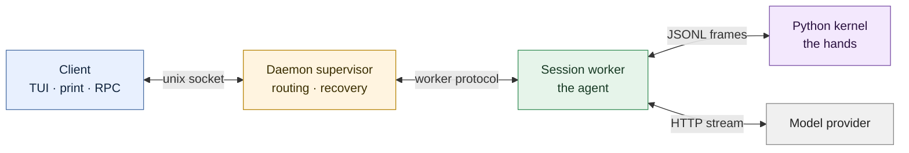
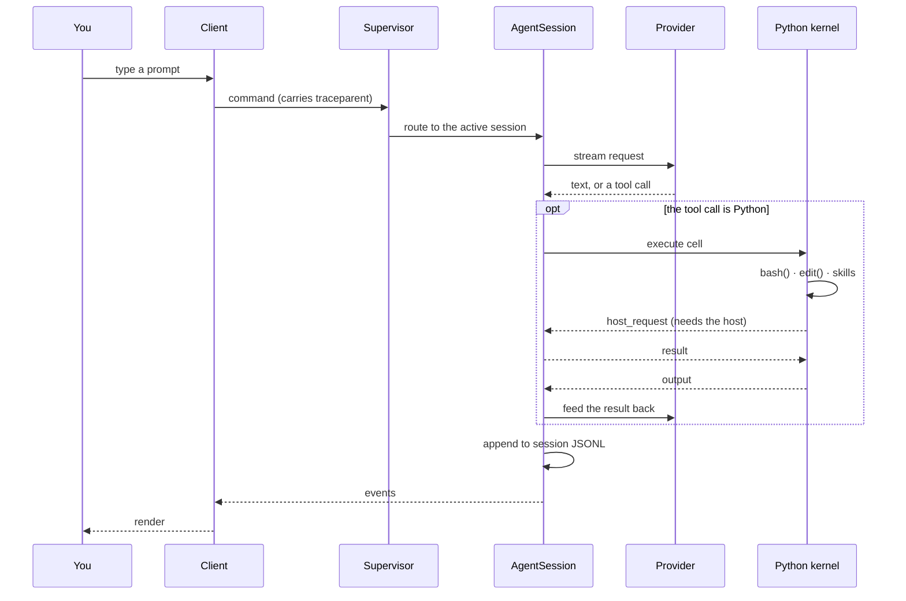
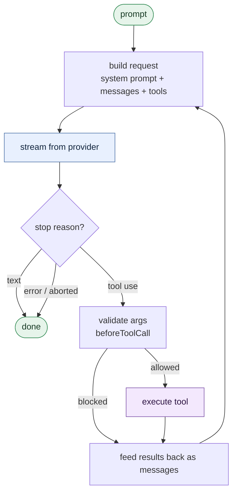
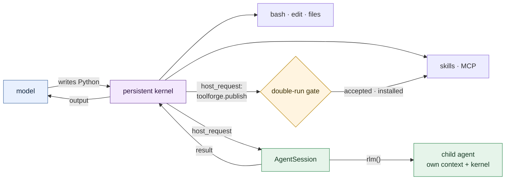
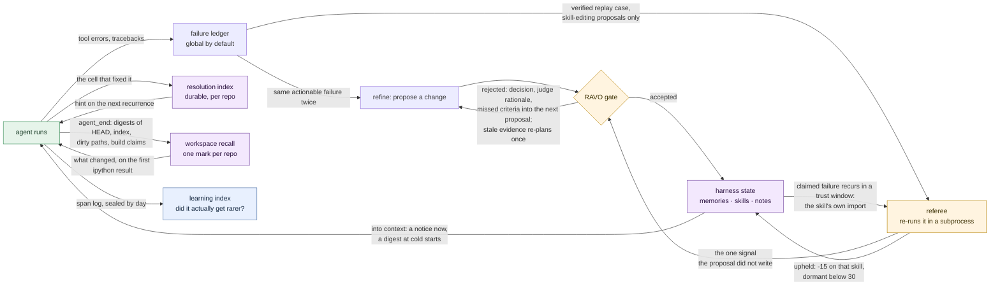

# Prime Agent — How It Actually Works

A living map of the architecture. Keep it current as the code changes; see [Keeping this current](#keeping-this-current).

Last verified against: `perf/session-catalog-resume` @ `f4afe5b5d`, plus the working tree · 2026-09-18

---

## 1. The ten-second version

Four kinds of process. The client draws; the daemon routes; the worker thinks; the kernel does.



The one thing to internalise: **the client does not run the agent.** Close the TUI and the worker keeps going. That is
the root of most of the rest of the design.

---

## 2. One prompt, end to end



Everything after "route to the active session" is identical whether the prompt came from you, a cron schedule, a
heartbeat, a goal continuation, or another agent. There is one execution path, not a special case per trigger.

---

## 3. The turn loop

This is the inner engine, in `packages/agent/src/agent-loop.ts`. It is deliberately small and knows nothing about
daemons, terminals, or Python.



A turn is one trip round that loop. A prompt is however many turns it takes to stop asking for tools.

---

## 4. What makes it different: the model programs its environment

This is the part that is genuinely unlike most agent harnesses.

In a conventional harness the model picks from a menu of fixed tools, each a leaf function that returns a value.
In Prime Agent the model's main tool is **a persistent Python REPL**. It writes code. The code calls `bash()`, edits
files, imports skills, and spawns child agents. State survives between cells — a variable set in turn 3 is still there
in turn 40.

And the arrow reverses: when that Python needs something only the TypeScript session can authorise — spawn a child
agent, message another agent, read the session — it sends a typed **host request** *back up* the channel.



Compare: a conventional harness is just `model → tool → result → model`, with nothing surviving between calls.

One host request is worth naming, because it is the only one that changes what the tool surface *is*.
`rlm.toolforge.publish(name, source, doc, exit_test)` hands the host a module and a test, and the host runs that test
twice in a subprocess: once against a stub whose every attribute raises, where it must fail, and once against the real
code, where it must pass. "Fails without, passes with" is the whole claim a new capability makes, and this is that
claim made executable. Only then is the package promoted into `~/.prime/agent/skills`, installed into the kernel venv,
and bound back into the live namespace — callable in the same cell that wrote it, and in every session after. A gate
that could not be run is never read as a pass.

Consequences worth knowing:

- The model can write a loop instead of emitting forty tool calls. Cheaper and faster when the work is repetitive.
- Agents nest. `rlm()` spawns a child session with its own context window; recursion depth is tracked.
- The tool surface is not fixed at startup. The agent can add to it mid-turn, and what it adds outlives the session.
- A dead kernel takes out every tool at once, which is why kernel restart and state restore matter so much.
- There is no sandbox. The kernel runs as you, with your permissions. Process separation here is for crash
  containment, not security.

---

## 5. Where Prime Agent sits among the alternatives

| | Claude Code | Most agent frameworks | **Prime Agent** |
|---|---|---|---|
| **Tool model** | fixed tools (Bash, Read, Edit, …) | fixed tools + plugins | persistent Python REPL; tools are library calls inside it |
| **State between calls** | none; each tool call is independent | usually none | full REPL state survives the whole session |
| **Process model** | one CLI process per session | in-process library | supervisor daemon + resident session workers + kernel children |
| **Session lifetime** | dies with the terminal | dies with the script | outlives the client; reattach later, run detached |
| **Subagents** | spawned, isolated, return text | varies | `rlm()` children with their own kernels, addressable, can message each other |
| **Observability** | logs | logs | one W3C `traceparent` per turn across every process and both languages |
| **Adding a capability** | write a skill file or wire up an MCP server | register a tool in code | `toolforge.publish()` from inside a running cell; gated by a double run, then installed |
| **Self-improvement** | none | none | Continual Harness learns; RAVO gates it, a referee re-runs the failure, `prime-agent learning` is *meant to* say whether it worked — see §6, it currently reads zero |

The honest summary: Claude Code optimises for a tight, predictable, reviewable single-session loop. Prime Agent trades
some of that predictability for **persistence, recursion, and self-modification** — it is built to run long, run
detached, and change itself.

---

## 6. The self-improvement plane

Sketch only — the detail lives in `packages/coding-agent/docs/ravo-architecture.md`.



Three planes, one sentence each:

- **RLM** computes — the kernel and the turn loop above.
- **Continual Harness** remembers — memories, skills, prompt notes, and a ledger of what keeps failing.
- **RAVO** governs — a weighted gate that decides which proposed self-change is allowed to stick.

Five loops run at different speeds, and they are not equally trustworthy:

| loop | horizon | what it changes | what checks it |
|---|---|---|---|
| resolution index | the same repo, later | nothing — it annotates the next failing `ipython` result with the cell that fixed it before | nothing re-runs it; the join from failure to fix is a heuristic |
| workspace recall | the same repo, next session | nothing — it appends a bounded `<workspace_recall>` block (at most 2 KB) to a top-level session's first `ipython` result: what changed since the last session's mark, how many paths provably did not, and which build claims still hold | every digest is recomputed from the live workspace; a build claim is CURRENT only when the whole workspace digest matches it exactly and nothing is unverifiable; no file content or command output is stored |
| refinement + RAVO | across sessions | harness state: memories, skills, prompt notes | a weighted gate, plus the referee below |
| toolforge (§4) | permanent | the tool surface itself | a double run: must fail on a stub, pass on the real code |
| learning index | weeks | nothing — it *is* the measurement | a one-sided Mann-Whitney U, treated fingerprints against the rest |

> **Reading zero.** The learning index is real code with real tests, and it has never produced a number. It needs
> `refinement.committed` records to form a treated cohort, and a first measurement found **0 of them in 193,538
> retained log lines**. Two causes were measured on 2026-09-16: none of the ~3,100 retained `kernel.host_request`
> spans is a `refine.*` request, so the agent itself never asked for a refine; and the global failure ledger was
> opt-in and unset (no `harness.ledger.flush` span is retained), so recurrence was counted within one session only.
> The ledger is now global by default. A `refinement.committed` line is now written only at apply time, and only for a
> commit that claimed at least one fingerprint; a claimless commit logs `refinement.applied_unmeasured`, and the index
> skips the claimless commit lines older builds wrote. The few `refinement.committed` lines the retained log holds
> today all come from the gate-time logger this replaced (none carries `reason`) and name a single fingerprint between
> them, far below the five-per-cohort minimum, so `prime-agent learning` still reports insufficient evidence.
> `ravo.run` proposals now log their outcome too (reason `ravo_run`), with the claim held to what the judge named and
> the certificate credited, so a RAVO run's commits reach the index as well; none has run on this machine (no RAVO-run
> checkpoint or archive on disk, no `ravo.run` span in the retained log). Two
> further caveats on the day it does: the comparison is treated-versus-everything-else, and fingerprints are selected
> for refinement *because* they recur often, so regression to the mean will flatter any intervention until the control
> cohort is matched on pre-treatment rate; and an in-cell traceback is counted twice, once on `kernel.cell` and once on
> the `tool.execute` that carries its fingerprint. Both are known, neither is fixed.

The **referee** is the interesting one. Every other opponent in the gate reduces to the proposal grading itself: the
proposal says it addressed a failure, and absent evidence it is believed. The referee is the only input the proposal
did not write — a recorded failure carries an executable replay case, and the referee re-runs it under `python -I` in a
subprocess. Still raises, or could not be run at all, and the claim is refused. It fails closed, deliberately unlike
the fast pre-screens, because here a verification that did not happen is the only thing standing between an unchecked
claim and a commit.

It only speaks where a replay can. A case is derived from the kernel's own traceback for a missing module or
distribution, and counts only once a self-check (`ravo.replay_verify`) has seen it reproduce. At the gate, the referee
runs a claimed fingerprint's verified cases only when a skill the proposal creates or updates imports what they probe.
Any other claim (a memory or prompt fix, a failure no probe describes) is `not_applicable`: nothing runs, the claim
stands, and the provisional window is its referee. A claim a replay should speak to but whose cases never reproduced
is `no_evidence`, and fails closed. In `/refine` the claim itself is the judge's; the proposal carries none.

It also speaks after the fact, and that is the only path by which a harness entry loses trust. When a failure a
committed refinement claimed recurs inside that commit's trust window, and the recurrence's own probe names an import
the skill it wrote still has exactly as the commit recorded it, the same replay runs again off the turn path
(`harness.trust.adjudicate`). Upheld costs that skill entry 15 trust points and faults the window; below 30 the entry
goes dormant — dropped from the rendered prompt, still readable and editable. Anything else leaves trust alone: a window
whose claim recurred without an upheld verdict closes contested and earns nothing, and one that closes with no
recurrence credits every entry it touched with 5.

A rejection changes nothing the working model sees. The proposal id is spent, and the rejection is recorded three ways:
in the session JSONL; in the refinement history of the scope it targeted, where the next planner reads its gate
decision, the judge's cleaned and quoted rationale and its missed criteria ids, never its scores; and as a
`refinement.rejected` log line carrying the `cause` that classified it. An auto-refine round then restarts its
20-minute cooldown, and a failure trigger does not fire again for that fingerprint in the same session. One case is
held open: a judge rejection made on evidence that arrived while the proposal was being planned, with no referee
verdict against the claim, is tagged stale and leaves its round open — no cooldown, no interval reset, the triggering
failures still held — to plan once more on the current conversation as soon as the session is idle. That re-plan closes
the round and is never re-planned itself; a user `/refine` is tagged but not re-planned. Only an applied refinement puts
a notice in the model's context.

The **learning index** is the honest end of all this: nothing feeds it back automatically. `agent.jsonl` rotates by
size, so the evidence for a multi-week trend is deleted before the trend can form; the index seals complete days into
`~/.prime/agent/learning` while the raw lines still exist. `prime-agent learning` then compares the fingerprints a
commit claimed to address against every other observed fingerprint, and withholds the p-value when either cohort is
too small. Nothing is randomised, so it measures association. A human reads it and decides.

RAVO is not hand-waving: there is a mechanised Rocq development of it at `~/RocqProjects/ravo/Ravo.v` (v5, 2 776
lines), plus 12 sibling projects in `~/RocqProjects/refereed-contest-market/` (471 `Qed`, no axioms, `coqchk` clean).

---

## 7. Everything is traced

One `traceId` per user turn, carried across every process boundary and into Python.

```
client.prompt → daemon.command → agent.prompt → agent.turn → llm.request
                                                           ↘ tool.execute → kernel.execute → kernel.cell
                                                                                            ↘ bash.command
                                                                                            ↘ kernel.host_request → rlm.child
```

The self-improvement gates hang too far right to draw on that line, so they are drawn separately:

```
kernel.host_request → toolforge.publish → toolforge.gate → ravo.replay_case
tool.prepare → extension.hooks → recall.digest
tool.execute → extension.hooks → recall.witness, recall.digest
ravo.evaluation → ravo.referee → ravo.replay_case                       (inside a ravo.run)

refine.plan → ravo.referee → ravo.replay_case                           (detached roots from here down)
refine.apply
ravo.replay_verify → ravo.replay_case
harness.trust.adjudicate → ravo.referee → ravo.replay_case
recall.mark
```

`ravo.referee` has three parents: `refine.plan` when `/refine` gates a proposal, `ravo.evaluation` inside a
`ravo.run`, and `harness.trust.adjudicate` for a post-commit trust replay. The last five roots run after or beside the
turn that started them, so each is a root of its own rather than a child that outlives its parent: `refine.plan`,
`refine.apply`, `harness.trust.adjudicate` and `recall.mark` carry that turn's trace id as `trigger.trace_id`, and
`refinement.id` joins a plan to its apply. A refine re-planned after a stale-evidence rejection is another
`refine.plan`/`refine.apply` pair of roots, joined to the rejection it replaces by `refine.replan_of`. Every
`ravo.replay_case` is a real subprocess.

| want | do |
|---|---|
| read one trace | `prime-agent trace <traceId>` |
| find the raw spans | `~/.prime/agent/logs/agent.jsonl` (+ `.old`, `.old.{1,2,3}.gz`) |
| know what a span means | `docs/observability.md` — every span, its attributes, and the file that opens it |
| know whether a change helped | `prime-agent learning` — rolls the log into `~/.prime/agent/learning`, which outlives rotation |
| ship traces out | set `OTEL_EXPORTER_OTLP_ENDPOINT` (opt-in, off by default) |

A span is a log line with `component: "trace"`, `msg: "span_end"`, carrying `traceId`, `spanId`, `parentSpanId`,
`durationMs`, `status`, `attrs`. That log is the system of record for runtime behaviour — when source reading and
observed behaviour disagree, the log wins.

---

## 8. Where the code lives

| package | published as | owns |
|---|---|---|
| `packages/ai` | `@earendil-works/pi-ai` | providers, streaming, model catalogue, trace context, OTLP export |
| `packages/agent` | `@earendil-works/pi-agent-core` | the turn loop (§3). No UI, no daemon. |
| `packages/coding-agent` | `@earendil-works/pi-coding-agent` | the product: sessions, daemon, kernel bridge, extensions, CLI |
| `packages/tui` | `@earendil-works/pi-tui` | terminal widgets, agent-agnostic |
| `prime-agent-runtime/` | (bundled) | the model-facing Python: `repl.py`, `bash.py`, `mcp.py`, `trace.py` |

Inside `packages/coding-agent/src`: `core/` is logic, `modes/` is a runnable mode, `cli/` is argv. **Modes may import
core; core must never import a mode.**

---

## Keeping this current

This file is the map, not the territory — it goes stale silently unless it is part of the change.

**Update it when you:**

- add or remove a process, or change what one owns
- change a protocol: daemon commands/events, kernel JSONL frames, host request types
- add, rename, or re-parent a span (also update `docs/observability.md`)
- change the turn loop's control flow or its hook surface
- change how sessions are stored, resumed, or compacted

**Do not update it for** a new tool, a new provider, a bug fix, or anything that does not move a box or an arrow.

**How:**

1. Change the diagram, not just the prose. If no diagram changed, ask whether the change was really architectural.
2. Bump the "Last verified against" line to the branch and short SHA you checked.
3. Keep it small. The value here is that it fits in your head; `packages/coding-agent/docs/architecture.md` is the
   place for depth.
4. Check the mermaid renders before committing.

**Deeper reading:** [`architecture.md`](packages/coding-agent/docs/architecture.md) ·
[`daemon.md`](packages/coding-agent/docs/daemon.md) ·
[`rlm-runtime.md`](packages/coding-agent/docs/rlm-runtime.md) ·
[`agent-connection.md`](packages/coding-agent/docs/agent-connection.md) ·
[`observability.md`](docs/observability.md)
