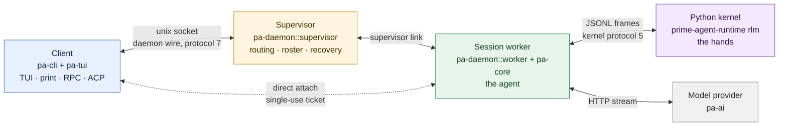
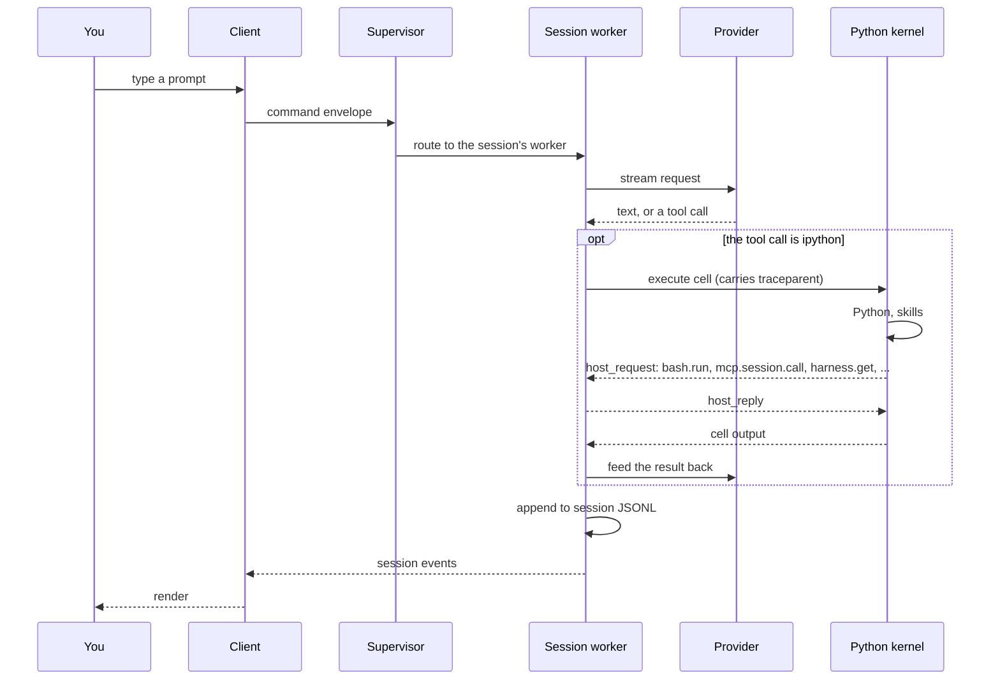
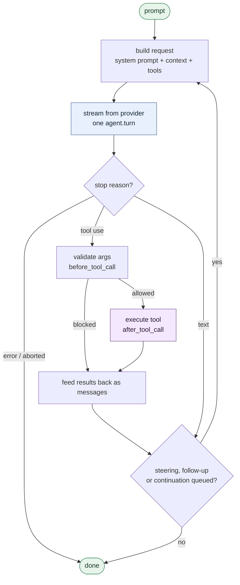
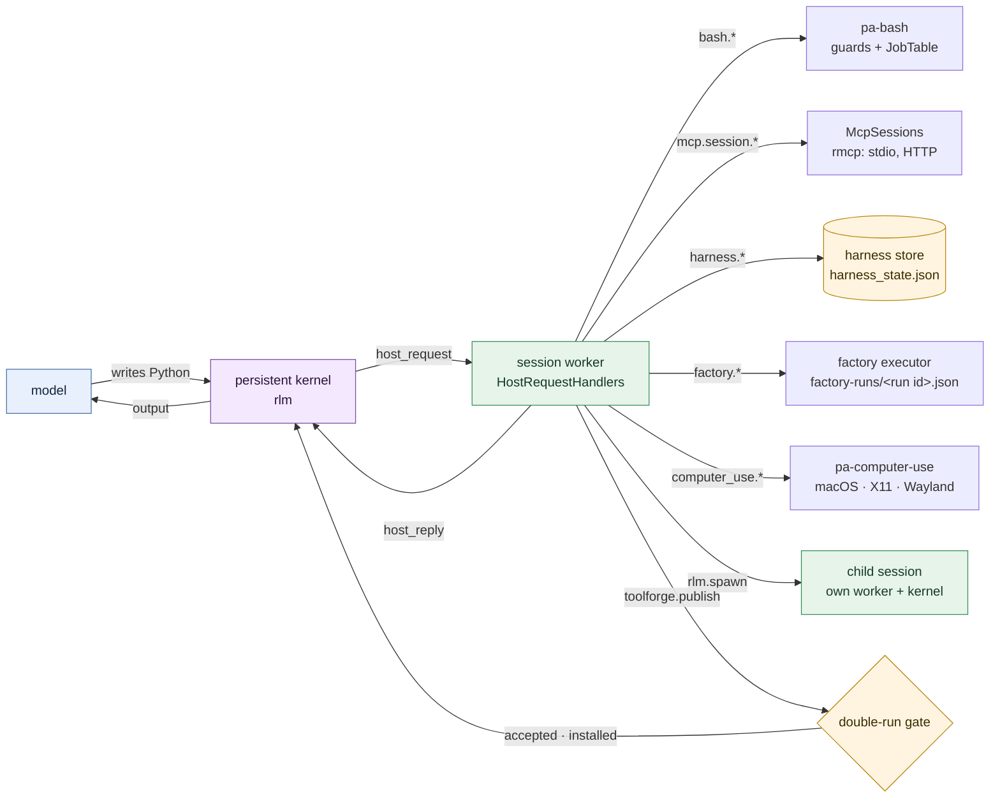
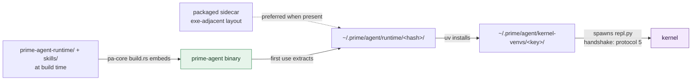
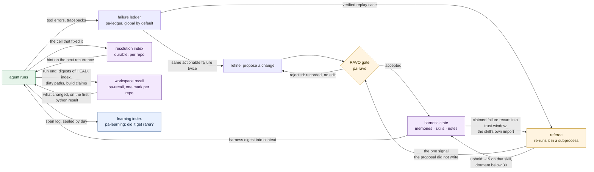

# Prime Agent — How It Actually Works

A living map of the architecture. Keep it current as the code changes; see [Keeping this current](#keeping-this-current).
Depth lives elsewhere: `AGENTS.md` → Crates (ownership and dependency direction), `CLAUDE.md` → Architecture First
(process boundaries), `docs/fork-feature-crates.md` (the fork's feature crates and their seams), and each
`crates/<crate>/README.md`.

Last verified against: `merge-rust-port` @ `6714b023f` · 2026-10-07

---

## 1. The ten-second version

Four kinds of process. The client draws; the supervisor routes; the worker thinks; the kernel does.


```mermaid
flowchart LR
    C["Client<br/>pa-cli + pa-tui<br/>TUI · print · RPC · ACP"]
    S["Supervisor<br/>pa-daemon::supervisor<br/>routing · roster · recovery"]
    W["Session worker<br/>pa-daemon::worker + pa-core<br/>the agent"]
    K["Python kernel<br/>prime-agent-runtime rlm<br/>the hands"]
    P["Model provider<br/>pa-ai"]

    C <-->|"unix socket<br/>daemon wire, protocol 7"| S
    S <-->|"supervisor link"| W
    C <-.->|"direct attach<br/>single-use ticket"| W
    W <-->|"JSONL frames<br/>kernel protocol 5"| K
    W <-->|"HTTP stream"| P

    style C fill:#e8f0fe,stroke:#4a6fa5,color:#11243d
    style S fill:#fff4e0,stroke:#b8860b,color:#3a2e00
    style W fill:#e6f4ea,stroke:#3a8f5a,color:#173a24
    style K fill:#f3e8fd,stroke:#7a4fa5,color:#2b1240
    style P fill:#f0f0f0,stroke:#888,color:#222
```

The one thing to internalise: **the client does not run the agent.** Close the TUI and the worker keeps going. That is
the root of most of the rest of the design. The headless print and json modes are the one exception: they drive the
session engine in-process (`crates/pa-cli/src/print_runtime.rs`).

| process | code | wire |
|---|---|---|
| client | `pa-cli` + `pa-tui` (never links the engine) | `pa-types::daemon`, `DAEMON_PROTOCOL_VERSION` 7 |
| supervisor | `pa-daemon::supervisor` | owns the socket lease, routing, roster, worker lifecycle; optional TCP listener |
| session worker | `pa-daemon::worker` + `pa-core::session_engine` | one per active session; journals to `~/.prime/agent/sessions` |
| Python kernel | `prime-agent-runtime/src/rlm/repl.py` | JSONL frames, `REPL_PROTOCOL_VERSION` 5 (`crates/pa-core/src/kernel/protocol.rs`) |

---

## 2. One prompt, end to end


```mermaid
sequenceDiagram
    participant U as You
    participant C as Client
    participant S as Supervisor
    participant W as Session worker
    participant P as Provider
    participant K as Python kernel

    U->>C: type a prompt
    C->>S: command envelope
    S->>W: route to the session's worker
    W->>P: stream request
    P-->>W: text, or a tool call
    opt the tool call is ipython
        W->>K: execute cell (carries traceparent)
        K->>K: Python, skills
        K-->>W: host_request: bash.run, mcp.session.call, harness.get, ...
        W-->>K: host_reply
        K-->>W: cell output
        W->>P: feed the result back
    end
    W->>W: append to session JSONL
    W-->>C: session events
    C-->>U: render
```

Everything after "route to the session's worker" is the same whether the prompt came from you, a scheduled job, a
heartbeat, a goal continuation, or another agent's message: each arrives as a queued row in that worker and runs
through the one `pa-agent` loop. There is no second execution path per trigger.

---

## 3. The turn loop

The inner engine is `run_loop` in `crates/pa-agent/src/agent_loop/run.rs`. It is deliberately small and knows nothing
about daemons, terminals, or Python: tools reach it through the `ToolDispatcher` boundary, and everything
session-specific is a hook on `AgentLoopConfig`.


```mermaid
flowchart TD
    START([prompt]) --> BUILD["build request<br/>system prompt + context + tools"]
    BUILD --> CALL["stream from provider<br/>one agent.turn"]
    CALL --> STOP{"stop reason?"}
    STOP -->|"tool use"| PREP["validate args<br/>before_tool_call"]
    PREP -->|"blocked"| FEED
    PREP -->|"allowed"| EXEC["execute tool<br/>after_tool_call"]
    EXEC --> FEED["feed results back as messages"]
    FEED --> POLL
    STOP -->|"text"| POLL{"steering, follow-up<br/>or continuation queued?"}
    STOP -->|"error / aborted"| DONE([done])
    POLL -->|"yes"| BUILD
    POLL -->|"no"| DONE

    style START fill:#e6f4ea,stroke:#3a8f5a,color:#173a24
    style DONE fill:#e6f4ea,stroke:#3a8f5a,color:#173a24
    style CALL fill:#e8f0fe,stroke:#4a6fa5,color:#11243d
    style EXEC fill:#f3e8fd,stroke:#7a4fa5,color:#2b1240
```

A turn is one trip round that loop. A prompt is however many turns it takes to stop asking for tools. The session
engine (`pa-core`) owns what the hooks do: compaction, refinement, goal continuation, and the fork features'
`SessionFeature` hooks.

---

## 4. What makes it different: the model programs its environment

This is the part that is genuinely unlike most agent harnesses.

In a conventional harness the model picks from a menu of fixed tools, each a leaf function that returns a value. In
Prime Agent the model's main tool is **a persistent Python REPL** (`ipython`; the surface is pinned in `AGENTS.md` →
"Surface contract"). It writes code. The code calls `bash()`, edits files, imports skills, and spawns child agents.
State survives between cells — a variable set in turn 3 is still there in turn 40.

The kernel's library is thin. Almost everything with side effects is a typed **host request** sent back up the JSONL
channel to the session worker, which serves it natively (`pa_core::kernel::shared::HostRequestHandlers`). The Python
side checks arguments and forwards; the Rust side owns the work, its state, and its limits.


```mermaid
flowchart LR
    M["model"] -->|"writes Python"| K["persistent kernel<br/>rlm"]
    K -->|"output"| M
    K -->|"host_request"| H["session worker<br/>HostRequestHandlers"]
    H -->|"host_reply"| K
    H -->|"bash.*"| BA["pa-bash<br/>guards + JobTable"]
    H -->|"mcp.session.*"| MC["McpSessions<br/>rmcp: stdio, HTTP"]
    H -->|"harness.*"| HS[("harness store<br/>harness_state.json")]
    H -->|"factory.*"| FX["factory executor<br/>factory-runs/&lt;run id&gt;.json"]
    H -->|"computer_use.*"| CU["pa-computer-use<br/>macOS · X11 · Wayland"]
    H -->|"rlm.spawn"| CH["child session<br/>own worker + kernel"]
    H -->|"toolforge.publish"| TF{"double-run gate"}
    TF -->|"accepted · installed"| K

    style M fill:#e8f0fe,stroke:#4a6fa5,color:#11243d
    style K fill:#f3e8fd,stroke:#7a4fa5,color:#2b1240
    style H fill:#e6f4ea,stroke:#3a8f5a,color:#173a24
    style CH fill:#e6f4ea,stroke:#3a8f5a,color:#173a24
    style TF fill:#fff4e0,stroke:#b8860b,color:#3a2e00
    style HS fill:#fff4e0,stroke:#b8860b,color:#3a2e00
```

What each host-side box owns:

| host request | served by | notes |
|---|---|---|
| `bash.run`, `bash.check`, `bash.kill`, ... | `pa-bash` (one `JobTable` per kernel manager) | the six refusal guards, then the job; answered for the activity view without a kernel round trip; killed with the kernel |
| `mcp.session.open`, `mcp.session.call_tool`, ... | `crates/pa-core/src/mcp/` (`McpSessions`, the `rmcp` SDK) | connections outlive kernel restarts; closed on reload, config change, idle, session end |
| `harness.get`, `harness.create`, `harness.list`, ... | `crates/pa-core/src/refinement/store/` | the one reader and writer of `harness_state.json`; `rlm/harness.py` is a thin client |
| `factory.run`, `factory.status`, `factory.resume`, ... | `pa-core::factory` (`FactoryExecutor`) | one executor per session, a durable record per run; a host restart pauses in-flight runs as interrupted |
| `computer_use.get_state`, `computer_use.list_apps`, ... | `pa-computer-use`, registered by `session_engine::computer_use_host` | the skill's Python is a thin client |
| `rlm.spawn`, `rlm.collect`, `rlm.list_subagents`, ... | `RlmSubagentHost`, implemented by `pa-daemon` | children are supervised workers with their own kernels |
| `toolforge.publish` | `pa-toolforge` | see below |

Compare: a conventional harness is just `model → tool → result → model`, with nothing surviving between calls.

One host request is worth naming, because it is the only one that changes what the tool surface *is*.
`rlm.toolforge.publish(name, source, doc, exit_test)` hands the host a module and a test, and the host runs that test
twice in an isolated subprocess: once against a stub whose every attribute raises, where it must fail, and once against
the real code, where it must pass. "Fails without, passes with" is the whole claim a new capability makes, and this is
that claim made executable. Only then is the package promoted into `~/.prime/agent/skills`, editable-installed into the
kernel venv, and bound back into the live namespace — callable in the same cell that wrote it, and in every session
after. A gate that could not be run is never read as a pass.

### Where the kernel's runtime comes from


```mermaid
flowchart LR
    SRC["prime-agent-runtime/ + skills/<br/>at build time"] -->|"pa-core build.rs embeds"| BIN["prime-agent binary"]
    PKG["packaged sidecar<br/>exe-adjacent layout"] -.->|"preferred when present"| RT
    BIN -->|"first use extracts"| RT["~/.prime/agent/runtime/&lt;hash&gt;/"]
    RT -->|"uv installs"| VENV["~/.prime/agent/kernel-venvs/&lt;key&gt;/"]
    VENV -->|"spawns repl.py<br/>handshake: protocol 5"| K["kernel"]

    style BIN fill:#e6f4ea,stroke:#3a8f5a,color:#173a24
    style K fill:#f3e8fd,stroke:#7a4fa5,color:#2b1240
```

A binary without a packaged layout (`cargo install`, `cargo run`) carries the runtime and skills it was built from and
extracts them to a content-addressed directory; the live source checkout is never read at run time
(`crates/pa-core/src/embedded_bundle.rs`). Each runtime identity gets its own venv under `kernel-venvs/<key>/`
(`crates/pa-core/src/kernel/bootstrap/venv/store.rs`), so switching binaries does not rebuild one shared venv;
`kernel-venv` is a link to the most recently booted one. The ready handshake refuses a runtime that speaks another
protocol, and the runtime-ready probe (`RUNTIME_READY_CHECK`) is pinned to `REPL_PROTOCOL_VERSION` by a test.
`PRIME_AGENT_RUNTIME_SOURCE` and `PI_PACKAGE_DIR` stay explicit overrides.

### The OS sandbox (opt-in)

The kernel runs as you. By default nothing confines it: process separation is for crash containment, not security.
The `sandbox` setting (or `--sandbox <mode>` for one run) turns on OS confinement from `pa-os-sandbox` — Landlock and
seccomp on Linux, Seatbelt on macOS, refused on Windows. `SessionSandbox::resolve` reads it once per session; the
kernel spawns under it, so every `bash()` and `subprocess` child inherits it, and the host's stdio MCP servers and the
`!` lane spawn through `SessionSandbox::command`. Modes are `off`, `read-only` and `workspace-write`; network is off
unless allowed. An enabled sandbox the machine cannot enforce refuses to spawn. See `docs/os-sandbox.md`.

Separately, workspace trust (`pa_core::workspace_trust`, `docs/workspace-trust.md`) keeps an untrusted project's
code-running configuration (project skills, `SYSTEM.md`, most project settings) out of the session until you trust it.

Consequences worth knowing:

- The model can write a loop instead of emitting forty tool calls. Cheaper and faster when the work is repetitive.
- Agents nest. `rlm.spawn` starts a child session with its own context window and kernel; recursion depth is tracked.
- The tool surface is not fixed at startup. The agent can add to it mid-turn, and what it adds outlives the session.
- A dead kernel takes out every tool at once, which is why kernel restart and state restore matter so much. Host-side
  state (MCP connections, factory runs, the harness store) survives a kernel restart.

---

## 5. Where Prime Agent sits among the alternatives

| | Claude Code | Most agent frameworks | **Prime Agent** |
|---|---|---|---|
| **Tool model** | fixed tools (Bash, Read, Edit, …) | fixed tools + plugins | persistent Python REPL; tools are library calls inside it, served by the host |
| **State between calls** | none; each tool call is independent | usually none | full REPL state survives the whole session |
| **Process model** | one CLI process per session | in-process library | supervisor daemon + one worker per session + kernel children |
| **Session lifetime** | dies with the terminal | dies with the script | outlives the client; reattach later, run detached |
| **Confinement** | permission prompts, optional sandbox | varies | opt-in OS sandbox around the kernel and everything it spawns |
| **Subagents** | spawned, isolated, return text | varies | `rlm.spawn` children with their own kernels, addressable, can message each other |
| **Observability** | logs | logs | one W3C trace per agent turn across the host and the Python kernel |
| **Adding a capability** | write a skill file or wire up an MCP server | register a tool in code | `toolforge.publish()` from inside a running cell; gated by a double run, then installed |
| **Self-improvement** | none | none | the continual harness learns; RAVO gates it; `prime-agent learning` measures whether it helped (§6) |

The honest summary: Claude Code optimises for a tight, predictable, reviewable single-session loop. Prime Agent trades
some of that predictability for **persistence, recursion, and self-modification** — it is built to run long, run
detached, and change itself.

---

## 6. The self-improvement plane

Sketch only. Every box below is a fork feature crate (`docs/fork-feature-crates.md`), wired in `pa-cli` behind a Cargo
feature and plugged into `pa-core` through `SessionFeature`; `--no-default-features` builds upstream's native product
without any of it. Detail lives in the crate READMEs (`pa-ledger`, `pa-ravo`, `pa-recall`, `pa-toolforge`,
`pa-learning`, `pa-dream`).


```mermaid
flowchart LR
    RUN["agent runs"] -->|"tool errors, tracebacks"| LED["failure ledger<br/>pa-ledger, global by default"]
    RUN -->|"the cell that fixed it"| RIX["resolution index<br/>durable, per repo"]
    RIX -->|"hint on the next recurrence"| RUN
    RUN -->|"run end: digests of HEAD, index,<br/>dirty paths, build claims"| WR["workspace recall<br/>pa-recall, one mark per repo"]
    WR -->|"what changed, on the first ipython result"| RUN
    LED -->|"same actionable failure twice"| REF["refine: propose a change"]
    LED -->|"verified replay case"| RFE["referee<br/>re-runs it in a subprocess"]
    REF --> GATE{"RAVO gate<br/>pa-ravo"}
    RFE -->|"the one signal<br/>the proposal did not write"| GATE
    GATE -->|"rejected: recorded, no edit"| REF
    GATE -->|"accepted"| HS["harness state<br/>memories · skills · notes"]
    HS -->|"harness digest into context"| RUN
    HS -->|"claimed failure recurs in a trust window:<br/>the skill's own import"| RFE
    RFE -->|"upheld: -15 on that skill,<br/>dormant below 30"| HS
    RUN -->|"span log, sealed by day"| LIX["learning index<br/>pa-learning: did it get rarer?"]

    style RUN fill:#e6f4ea,stroke:#3a8f5a,color:#173a24
    style GATE fill:#fff4e0,stroke:#b8860b,color:#3a2e00
    style RFE fill:#fff4e0,stroke:#b8860b,color:#3a2e00
    style HS fill:#f3e8fd,stroke:#7a4fa5,color:#2b1240
    style RIX fill:#f3e8fd,stroke:#7a4fa5,color:#2b1240
    style WR fill:#f3e8fd,stroke:#7a4fa5,color:#2b1240
    style LIX fill:#e8f0fe,stroke:#4a6fa5,color:#11243d
```

Three planes, one sentence each:

- **RLM** computes — the kernel and the turn loop above.
- **Continual harness** remembers — memories, skills, prompt notes, subagent and factory specs in `harness_state.json`
  (`pa-core::refinement`), plus a ledger of what keeps failing (`pa-ledger`).
- **RAVO** governs — a weighted gate (`pa-ravo`) that decides which proposed self-change is allowed to stick.

Five loops run at different speeds, and they are not equally trustworthy:

| loop | horizon | what it changes | what checks it |
|---|---|---|---|
| resolution index | the same repo, later | nothing — it annotates the next failing `ipython` result with the cell that fixed it before (`<ipython_resolution_hint>`) | nothing re-runs it; the join from failure to fix is a heuristic |
| workspace recall | the same repo, next session | nothing — it appends a bounded `<workspace_recall>` block (at most 2 KB) to a top-level session's first `ipython` result: what changed since the last mark, how many paths provably did not, and which build claims still hold | every digest is recomputed from the live workspace; a build claim is CURRENT only while the workspace digest it was recorded against still matches; no file content or command output is stored |
| refinement + RAVO | across sessions | harness state: memories, skills, prompt notes | a weighted gate, plus the referee below |
| toolforge (§4) | permanent | the tool surface itself | a double run: must fail on a stub, pass on the real code |
| learning index | weeks | nothing — it *is* the measurement | a one-sided Mann-Whitney U, treated fingerprints against the rest |

The **gate** (`ravo_evaluate_proposal`) runs on every planned, non-empty `/refine` proposal: a structural fast screen
(threshold 50), one deep-judge model call (within 10 of the lineage's best), the referee, and the pure reducer's
decision (`ravo_step`) against a weighted opponent pool where the missed weight must stay within epsilon 1. A commit
doubles the weight of what it missed, so the same weakness cannot pass twice, and the decision is bound to digests of
the proposal and the harness baseline it was judged against (`authorize_assisted_ravo`). `PRIME_AGENT_RAVO=0` turns
the gate off.

The **referee** is the interesting one. Every other opponent in the gate reduces to the proposal grading itself. The
referee is the only input the proposal did not write: a recorded failure carries an executable replay case, and the
referee re-runs it in the kernel's Python (`-I -B`, sanitized environment, own process group, 10 s timeout). Still
raises, or could not be run at all, and the claim is refused. It fails closed, deliberately unlike the fast screen.
Cases are derived from the kernel's own traceback for a missing module or distribution, count only once a self-check
has seen them reproduce, and run only when a skill the proposal writes imports what they probe; any other claim is
`not_applicable` and the trust window is its referee.

It also speaks after the fact, the only path by which a harness entry loses trust. A gated commit that claims
fingerprints opens a 20-wide trust window over the entries it wrote. When a claimed failure recurs inside it and the
recurrence probes an import the written skill still has, the replay runs again off the turn path
(`harness.trust.adjudicate`). Upheld costs that skill 15 trust points and faults the window; below 30 an entry goes
dormant — left out of the rendered digest, still readable and editable. A window that closes with no recurrence
credits everything it wrote with 5.

`ravo.run` (and `/ravo <task>`) runs the same gate as an agentic variation loop — inspect, plan, implement, evaluate,
diagnose and repair — in the background, until accepted or a round, repair, deadline or token limit; every step lands
in a hash-chained archive under `<store>/ravo/archive/`.

The **learning index** is the honest end of all this: nothing feeds it back automatically. `agent.jsonl` rotates by
size, so the evidence for a multi-week trend is deleted before the trend can form; the index seals complete days into
`~/.prime/agent/learning` while the raw lines still exist. `prime-agent learning` then compares the fingerprints a
commit claimed to address (`refinement.committed` lines) against every other observed fingerprint, and withholds the
p-value when either cohort is too small. Nothing is randomised, so it measures association. A human reads it and
decides. Two caveats carry over from the TS measurement of 2026-09-16, when the index first read zero: fingerprints are
selected for refinement *because* they recur often, so regression to the mean flatters any intervention until the
control cohort is matched on pre-treatment rate; and the comparison is treated-versus-everything-else.

### Not ported from the TS fork

Parts of the TS plane the Rust crates do not have (each crate README lists its own non-goals):

- the skill dry-run in the fast screen (the screen is structural only);
- the stale-evidence re-plan and the rejection history fed to the next planner; a rejection is recorded on the session
  and as a `refinement.rejected` log line only;
- the `refine.plan` / `refine.apply` / `ravo.referee` / `ravo.replay_case` / `ravo.replay_verify` spans;
- trust bookkeeping on ungated refines;
- the ARC-AGI evaluator for `ravo.run` (`/ravo --arc-repo/--arc-game` is refused), the retained worker runtime, and
  resuming a run from its checkpoint.

RAVO is not hand-waving: there is a mechanised Rocq development of it at `~/RocqProjects/ravo/Ravo.v` (v5, 2,776
lines), plus 12 sibling projects in `~/RocqProjects/refereed-contest-market/`. `docs/avo-loop.mmd` maps the loop to it.

---

## 7. Everything is traced

The `pa-trace` crate installs a `tracing` layer that turns native spans into W3C-traced `span_end` records in
`~/.prime/agent/logs/agent.jsonl`, and forwards the kernel's own spans verbatim. The context crosses into the kernel on
the execute frame's `traceparent` field and the kernel's `TRACEPARENT` environment, and into each `bash()` command's
environment.

```
agent.turn → llm.request
           ↘ tool.execute → kernel.execute → kernel.cell                    (kernel.cell and below: Python runtime)
                                                       ↘ bash.command
                                                       ↘ kernel.host_request
                                                       ↘ mcp.call
```

The feature crates add their own spans:

```
agent.turn → recall.digest                                              (before an ipython cell runs)
tool.execute → recall.witness, recall.digest                            (after it ran)
toolforge.publish → toolforge.gate                                      (served for a kernel.host_request)
ravo.run → ravo.round → ravo.proposal → ravo.evaluation

harness.ledger.flush                                                    (detached roots from here down)
harness.trust.adjudicate
recall.mark
```

The last three run after or beside the turn that started them, on a worker thread of their own, so each is a root
rather than a child that outlives its parent. Not ported: a trace starts at `agent.turn` (unless the process was started with a `TRACEPARENT`); the TS client and daemon
spans (`client.turn`, `daemon.command`, `agent.prompt`) and the daemon envelope's `traceparent` carrier are not
emitted, so one user prompt of several turns is several traces.

| want | do |
|---|---|
| read one trace | `prime-agent trace <traceId>` |
| find the raw spans | `~/.prime/agent/logs/agent.jsonl` (+ `.old`, `.old.<n>.gz`) |
| know whether the log shows trouble | `prime-agent health` |
| know whether a change helped | `prime-agent learning` — rolls the log into `~/.prime/agent/learning`, which outlives rotation |
| ship traces out | set `OTEL_EXPORTER_OTLP_ENDPOINT` (opt-in, off by default) |

A span is a log line with `msg: "span_end"`, carrying `traceId`, `spanId`, `parentSpanId`, `durationMs`, `status`,
`attrs`. That log is the system of record for runtime behaviour — when source reading and observed behaviour disagree,
the log wins.

---

## 8. Where the code lives

Native crates (dependency direction pinned in `AGENTS.md` → Crates):

| crate | owns |
|---|---|
| `pa-types` | shared wire and domain types: the daemon wire, trace context, slash-command registry |
| `pa-telemetry` | adoption events and sinks |
| `pa-agent` | the turn loop (§3). No UI, no daemon, no tools. |
| `pa-ai` | providers, streaming, request hooks |
| `pa-models` | the live model catalog |
| `pa-sandbox` | Prime Sandboxes lifecycle client |
| `pa-os-sandbox` | OS confinement: Landlock/seccomp, Seatbelt |
| `pa-bash` | kernel `bash()`: refusal guards and the job runner |
| `pa-computer-use` | the computer-use skill's host side |
| `pa-core` | session engine, tools, kernel manager, skills, MCP, harness store, factory, settings |
| `pa-daemon` | supervisor, workers, wire serving |
| `pa-tui` | terminal UI; a wire client only |
| `pa-cli` | `prime-agent`, the composition root; no logic |

Fork feature crates, wired only in `pa-cli` (`crates/pa-cli/src/features.rs`) behind its default Cargo features:
`pa-trace`, `pa-recall`, `pa-toolforge`, `pa-dream`, `pa-workflow`, `pa-ledger`, `pa-ravo`, `pa-learning`,
`pa-session-index`, `pa-mermaid`, `pa-anthropic-auth`. No native crate depends on them. `pa-anthropic-auth` is the one
that touches the provider path: it installs a `ProviderCredentialSource` (`pa_core::auth`) and `ProviderRequestHooks`
(`pa_ai::request_hooks`) for the `anthropic` provider, so its OAuth credential comes from the shared
`~/.anthropic-accounts` store.

Outside `crates/`: `prime-agent-runtime/` is the model-facing Python (`repl.py`, `bash.py`, `mcp.py`, `harness.py`,
`factory.py`, `trace.py`), mostly thin clients of the host; `skills/` holds the bundled skills (`skills/.features/`
for the feature crates' skills). Both are embedded in the binary (§4).

---

## Keeping this current

This file is the map, not the territory — it goes stale silently unless it is part of the change.

**Update it when you:**

- add or remove a process, or change what one owns
- change a protocol: daemon commands/events, kernel JSONL frames, host request types
- move work between the kernel and the host
- add, rename, or re-parent a span (also update `docs/observability.md`)
- change the turn loop's control flow or its hook surface
- change how sessions are stored, resumed, or compacted

**Do not update it for** a new tool, a new provider, a bug fix, or anything that does not move a box or an arrow.

**How:**

1. Change the diagram, not just the prose. If no diagram changed, ask whether the change was really architectural.
2. Bump the "Last verified against" line to the branch and short SHA you checked.
3. Keep it small. The value here is that it fits in your head; the crate READMEs are the place for depth.
4. Check the mermaid renders before committing (mmdc renders every block of this file).

**Deeper reading:** [`AGENTS.md`](AGENTS.md) ·
[`docs/fork-feature-crates.md`](docs/fork-feature-crates.md) ·
[`prime-agent-runtime/src/rlm/repl.md`](prime-agent-runtime/src/rlm/repl.md) ·
[`crates/pa-daemon/README.md`](crates/pa-daemon/README.md) ·
[`docs/os-sandbox.md`](docs/os-sandbox.md) ·
[`docs/observability.md`](docs/observability.md)
