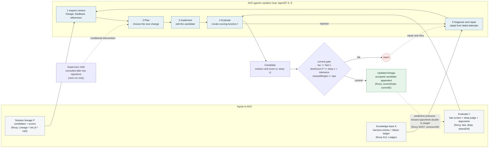
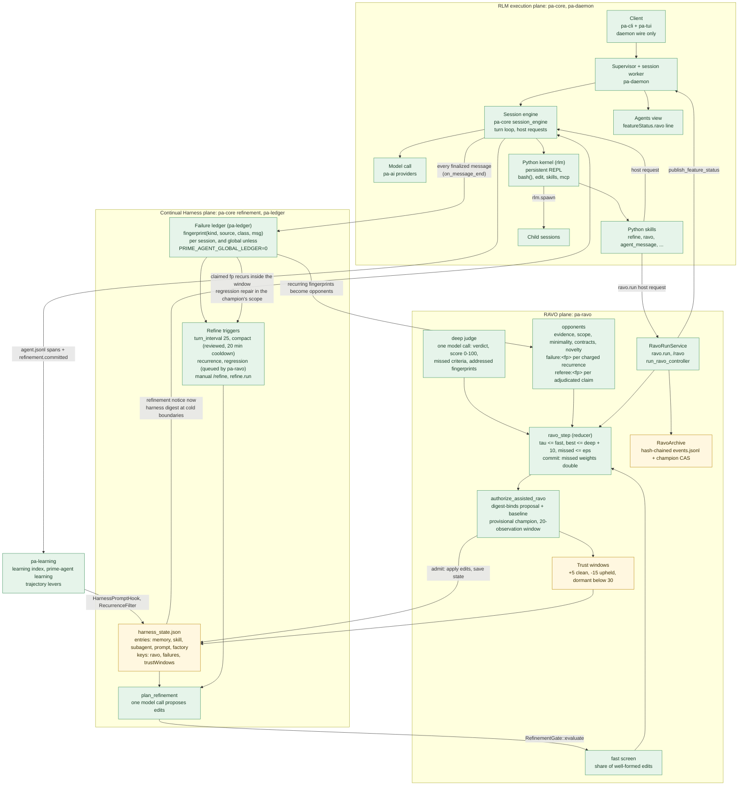
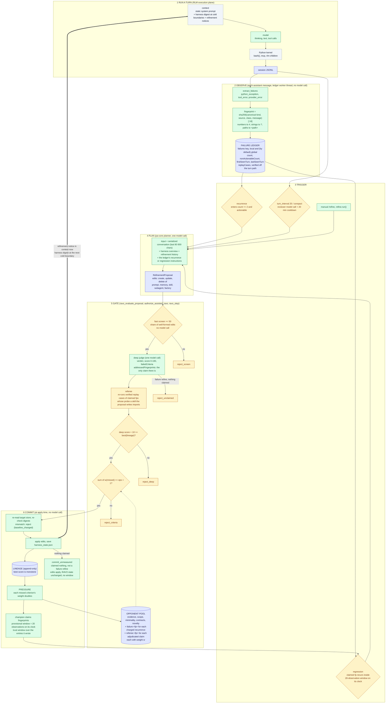
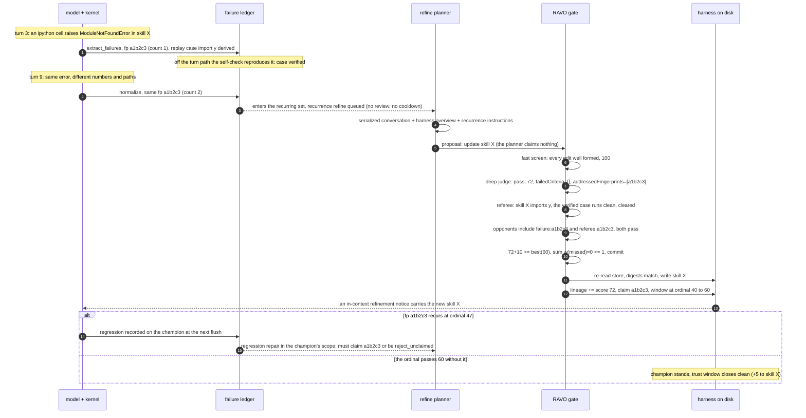

# RAVO and Prime Agent architecture (Mermaid)

Machine-readable maps for agents working on or inside the RAVO loop. The diagrams are plain Mermaid so a model can
read the edges directly; the Rocq references point at sections of the mechanised development in
~/RocqProjects/ravo/Ravo.v (outside this repo) that prove the corresponding property.

RAVO is a fork feature crate (`docs/fork-feature-crates.md`). The code is `crates/pa-ravo` (gate, referee, trust,
`ravo.run`, `/ravo`) on top of `crates/pa-ledger` (failure ledger, replay cases, resolution index), with
`crates/pa-learning` measuring the outcome. It plugs into the native refinement engine in `pa-core` only through
generic seams, and `pa-cli` wires it in `crates/pa-cli/src/features.rs` behind the Cargo features `ledger`, `ravo`
(implies `ledger`) and `learning` (implies `ravo`). Each crate's `README.md` is the precise reference; this document
is the map.

## AVO agentic variation loop

Two instantiations run this loop. Every gated `/refine` (and every other planned refine) is one pass of steps 4 and 5
with a single candidate: the gate decides, and a rejection is final for that proposal. `ravo.run` (or `/ravo <task>`)
runs the whole loop: inspect, plan, implement or repair, evaluate, step the reducer, until a commit or a limit.

## Prime Agent: three planes

## Reading the loop

- `P`, `K`, `f` are the three inputs of Agent(P, K, f). In Prime Agent, `P` is the lineage in the `ravo` key of the
  target store's `harness_state.json` (`RavoState`), `K` is the harness entries plus the `failures` ledger, and `f` is
  the screen, judge and opponent set that `ravo_evaluate_proposal` (for a refine) or `RavoRunService` (for a run)
  builds.
- The commit gate is the only place the lineage changes. A rejection never applies an edit; in `/refine` the proposal
  id is spent, in `ravo.run` it routes to diagnose and repair.
- Weakness pressure runs on commit: every opponent the accepted candidate missed doubles in weight (`ravo_pressure`),
  so the same gap costs twice as much next time. Rocq's pressureW doubles one weak opponent; its lemma pressureW_ge
  (weights never decrease) holds for the reducer's per-criterion doubling as well.
- The token budget and deadline of a `ravo.run` are stop conditions, not gates: they bound cost and do not affect which
  candidates can commit.

## The self-improvement loop, end to end

Stages: run a turn; the ledger observes every finalized message on its own worker thread and treats each assistant
message as a turn boundary (`pa-ledger`, through the `on_message_end` hook of `SessionFeature`); a trigger fires (a
fingerprint entering the recurring set, a claimed fingerprint recurring inside a champion's window, the reviewed
turn-interval or compaction checkpoint, or a manual `/refine` / `refine.run`); the native planner proposes edits from
the serialized conversation (`plan_refinement`); the gate evaluates the plan with one model call (the `RefinementGate`
trait in `pa_core::refinement::gate`, implemented by `pa-ravo`); its verdict (`RefinementGateVerdict`) admits or
refuses against the target store re-read at apply time; an applied change reaches the running model as an in-context
refinement notice, and later contexts through the harness digest at cold boundaries. The system prompt stays static.

One concrete cycle:

## Claims, clocks, and the referee

- **The judge makes the claim.** A `/refine` proposal carries no claim of its own: the planner's output is a summary,
  rationale, expected outcome and edits. The deep judge names the fingerprints the edits address, filtered to the
  recurring failures the gate charges, and only that list opens a provisional window and a trust claim. `ravo.run`
  differs: its implement child writes `addressedFingerprints` into the artifact, and its opponents, referee and commit
  gate read that. Its outcome line holds that claim to the judge: a run's commit logs `refinement.committed` only for
  claims the judge also named and the certificate credited; a self-claim alone logs `refinement.applied_unmeasured`,
  though the champion still records it.
- **Where a `ravo.run` commits.** A local run reads, gates against and commits into the session store. A global run
  (`global_=True` in the `ravo` skill, `/ravo --global`) uses the global store: its lineage, opponents, entries and
  failure ledger. Its commit reads, applies and saves under the harness state lock every ledger flush takes
  (`acquire_harness_state_lock`). Checkpoints (`<store>/ravo/runs/<runId>.json`) and the archive
  (`<store>/ravo/archive/`) live under the store the run targets. One run per session at a time, in the background,
  only in a top-level session with a local harness store (`ravo_run_allowed`); limits default to 4 rounds, 3 repairs,
  20 minutes and 1.5M tokens (`RAVO_RUN_MAX_ROUNDS`, `RAVO_RUN_MAX_REPAIRS`, `RAVO_RUN_DEADLINE`,
  `RAVO_RUN_TOKEN_BUDGET`). It stops with one of `RavoStopReason`: accepted, round or repair limit, deadline, budget,
  cancelled, or `stale_cas` when the store moved under it.
- **What a refine is charged.** A fingerprint recurs when its record is at or over the threshold (count >= 2,
  `DEFAULT_RECURRENCE_THRESHOLD`) and actionable. A refine is always charged the fingerprints whose recurrence or
  regression queued it (`triggerFingerprintIds`), on their record in the recurrence ledger (the global one while it is
  on), else on the session's own record. A failure refine (`recurrence`, `regression`) is held to its triggers alone.
  Any other refine is also charged the fingerprints recurring in the session's own ledger that were last seen no more
  than 20 assistant turns before the branch's current turn and not after it; a failure last seen at a later turn than
  the branch has reached (as after a rewind) was seen on another branch and is not recent. A record is actionable
  unless a strict majority of its occurrences classified non-actionable (`nonActionableCount`: an abort, a denial, a
  dead kernel, the network, a timeout, provider capacity). A `refine.run` merged into a queued failure refine is gated
  as directed.
- **Claimless results.** A failure refine the judge credits with no fingerprint is `reject_unclaimed`. Any other refine
  that commits without a claim is `commit_unmeasured`: the edits apply, the RAVO state is left as it was (no lineage
  entry, no pressure, no window), and the outcome line is `refinement.applied_unmeasured`, never
  `refinement.committed`. A `ravo.run` commit with no credited claim logs the same line but does advance the RAVO
  state: it earned its certificate on that run's own evaluators.
- **Window clocks.** A provisional window is `[ordinal, ordinal + 20]`, counted in failure observations rather than
  turns, on the clock stamped with it (`RavoWindowClock`). `ordinal` is the global ledger's observation total, used for
  local and global champions alike while the global ledger is on. `local-ordinal` is the session ledger's total, used
  for a local window opened while it is off; a global window opened then gets no clock. A window is compared only with
  an ordinal read off its own clock, and a window with no clock or one this build does not know (stripped on load)
  never regresses, so flipping `PRIME_AGENT_GLOBAL_LEDGER` cannot reopen a closed window or match across clocks.
- **Trust after commit.** An upheld post-commit replay is the only thing that debits trust, and attribution is the
  whole difficulty: a fingerprint folds every missing module into one, a memory or prompt fix cannot be probed, and the
  skill may have been rewritten since. So a gated commit that claims fingerprints opens a trust window
  (`trustWindows[<proposalId>]`) recording the entries it wrote and the imports each written skill names. A replay is
  planned only for a skill that still imports exactly what the commit recorded, only on the newest window that wrote
  it, and only when the recurrence's own case probes one of those imports. A case not yet verified waits for its
  self-check. The replays run off the turn path under the root span `harness.trust.adjudicate`, at most 8 per batch
  (`MAX_TRUST_ADJUDICATION_JOBS`) and one batch at a time per session. Windows settle at each ledger flush and before a
  refine's edits apply (`prepare_application`).

  | situation | trust effect | re-run |
  |---|---|---|
  | `upheld` | -15 once per window on the skill entry the replay ran for; window `faulted` | never |
  | `cleared` / `unverifiable` | none | on a later qualifying recurrence, up to 3 runs per (window, entry, fingerprint) |
  | recurrence of another module, or no applicable verified case | nothing runs | none |
  | window closes after a recurrence with no upheld verdict | `contested`: no credit, no debit | none |
  | window closes with no recurrence | `clean`: +5 to every entry it touched | none |

  A memory or prompt entry the same commit wrote is never debited; it can only miss the credit. Trust is clamped to
  [0, 100] and defaults to 50 (`DEFAULT_ENTRY_TRUST`). Below 30 (`DORMANT_TRUST_THRESHOLD`) an entry is dormant: the
  `HarnessPromptHook` withholds it from the rendered harness digest and from the judge's overview (a
  `- +N dormant <kind> entries (below trust threshold; still readable and editable)` line), and it stays fully readable
  and editable.
- **Regression repair.** A regressed champion is repaired in its own scope. Local and global regressions queue separate
  failure refines, a request merges only into a pending one of its own scope and parks behind one of the other scope,
  and each fingerprint queues at most once per kind per session. A pending request an aborted turn drops unserviced
  (`RefineRequester::on_dropped`) releases its fingerprints so they may queue a repair again.
- **After a rejection.** When the certificate still binds, the consumed evaluation is saved into the `ravo` key, so the
  proposal id cannot be evaluated again. The rejected result is recorded on the session JSONL (an audit row and an
  outcome row) and, for a global refine, in `<agentDir>/harness/refinement_history.jsonl`; the outcome line
  `refinement.rejected` carries the `cause` that classified it (`gate`, `screen`, `judge_unavailable`,
  `baseline_changed`). A failure trigger fires once per fingerprint per session, so a rejected recurrence or
  regression refine is not retried in that session. The working model is not told: only an applied refinement adds a
  model-facing notice.

The referee derives replay cases only from the kernel's own traceback for an `ipython` cell that raised, and only as
two side-effect-free probes (`ReplayProbe`): `import X` (no module named X) and `importlib.metadata.version("d")` (no
package metadata). A private module segment or a top-level module in `REPLAY_MODULE_DENYLIST` is never derived or run
(`is_replayable_module_path`), and a record keeps at most 8 distinct cases (`MAX_REPLAY_CASES`); stored cases that no
longer re-render as a valid probe are dropped when the ledger is next loaded or written. A case is evidence only after
the self-check saw it reproduce its recorded exception: each boundary's newly derived cases run off the turn path in
the sanitized environment, and a reproduction is written at the ledger's next flush (`record_replay_verifications`).
At the gate, each claimed fingerprint gets one verdict (`RefereeVerdictStatus`):

| status | when | effect |
|---|---|---|
| `not_applicable` | no case probes a module or distribution that a skill create/update in the proposal imports (a memory or prompt fix), or no case is derivable | nothing runs; the claim stands and the provisional window is its referee |
| `no_evidence` | applicable cases exist, none ever verified | `failure:<fp>` fails: the expected evidence is missing, so the claim fails closed |
| `upheld` | a verified applicable case raised its recorded exception again | `failure:<fp>` and `referee:<fp>` fail |
| `unverifiable` | a verified applicable case could not run, or raised something else | `failure:<fp>` and `referee:<fp>` fail |
| `cleared` | every verified applicable case ran clean | `failure:<fp>` and `referee:<fp>` pass |

`PythonReplayRunner` runs every case in the kernel's Python in isolated mode (`-I -B`, the program on stdin), in a
fresh temporary working directory, with an environment of `PATH`, `HOME` and `LANG` (on Windows also what CPython needs
to start) plus explicit `sys.path` roots, under a 10 s timeout (`DEFAULT_REPLAY_TIMEOUT`). The self-check uses that
sanitized environment (`ReplayEnvironment::Sanitized`); adjudication and the post-commit trust replay add the host's
`PYTHONPATH` entries (`ReplayEnvironment::SkillImport`), so the two adjudications cannot disagree. The interpreter
leads its own process group, killed when the run ends, and is recorded in the orphan process journal while it runs, so
supervisor recovery reaps it after a worker is killed outright. Only `upheld`, `unverifiable` and `cleared` add
`referee:<fp>` to the pool. Persisted criteria a `/refine` or a judge `ravo.run` never observes are dormant passes and
keep their weights.

## Seams and files

The crates touch native code only through these generic seams (details in each crate's README):

| seam | used by | for |
|---|---|---|
| `SessionFeature::refinement_gate` (`RefinementGate`, `RefinementGateVerdict`) | `pa-ravo` | gate every planned refine, hold ledger flushes while it runs, lock the global store, admit or refuse at apply time |
| `RefineRequester` (`pa_core::session_engine::turn_boundary`) | `pa-ravo` | queue recurrence and regression refines for the next serviced turn boundary |
| `SessionFeature::auto_refine_policy` (`AutoRefinePolicy`) | `pa-ravo` | `GlobalDefaultAutoRefine`: the reviewer may pick `scope`, global by default |
| `SessionFeature::harness_prompt_hook` (`HarnessPromptHook`) | `pa-ravo`, `pa-learning` | withhold dormant entries; rank entries by trajectory and add the trajectory section |
| `LedgerObserver` / `LedgerHandle` (`pa-ledger`) | `pa-ravo` | see each boundary, write the `ravo` and `trustWindows` keys inside the ledger's flush |
| `RecurrenceFilter` | `pa-learning` | mute recurrence refines for fingerprints the trajectory index labels DROPPED |
| `SessionFeature::register_host_handlers`, `slash_commands`, `bundled_skills` | `pa-ravo` | `ravo.run`, `ravo.status`, `ravo.cancel`; `/ravo`; the `ravo` skill (`skills/.features/ravo`) |
| `publish_feature_status` | `pa-ravo` | each run update as feature `ravo` (`featureStatus.ravo`, `ravo_status_line`) |

Files: the `ravo` and `trustWindows` keys of `<sessionArtifactDir>/harness/harness_state.json` and
`<agentDir>/harness/harness_state.json` (`pa-ravo`), their `failures` key and
`<agentDir>/resolution/<basename>.<hash>.json` (`pa-ledger`), and `<agentDir>/learning/` (`pa-learning`). All are
byte-compatible with the TS fork, proven by node-generated goldens in each crate's `tests/`. `PRIME_AGENT_RAVO=0`
turns the gate off at run time; building `pa-cli` without the `ravo` feature removes it entirely.

## Differences from the TS fork

The Rust crates reproduce the TS gate, referee, trust and run service byte for byte where they write files. These TS
behaviours are not ported (each crate README lists its own non-goals):

- **Skill dry-run in the fast screen.** TS imported each proposed skill in the kernel and resolved its callable
  (`refinement/skill-dry-run.ts`); the Rust screen is structural only.
- **Evidence drift and the stale-evidence re-plan.** TS recorded how far the conversation moved between planner and
  judge (`refine.evidence_drift`) and re-planned a judge rejection made on moved evidence once (`stale_evidence`,
  `refine.replan_of`). `RejectionCause` keeps the `stale_evidence` spelling for stored results, but nothing produces
  it.
- **Rejection history for the planner.** TS fed each rejection's gate decision, cleaned judge rationale and missed
  criteria into the next planner prompt, and kept a per-session `local-refinements/<sessionId>.jsonl`. The native
  planner's history lists prior results' edits and expected outcomes only, and a local rejection is recorded only on
  the session JSONL.
- **Spans.** `ravo.referee`, `ravo.replay_case` and `ravo.replay_verify` are not emitted; `ravo.run`, `ravo.round`,
  `ravo.proposal`, `ravo.evaluation` and `harness.trust.adjudicate` are. `harness.trust.adjudicate` has no
  `trigger.trace_id` (the ledger's boundary runs on its worker thread, outside the turn's trace), and there is no
  native refine span to carry `trust.*` attributes or `refine.trust_window_opened`.
- **Trust on ungated refines.** TS gave every entry any refine wrote a trust record and settled windows at every apply;
  here only a gated commit does (an absent record reads as the default score).
- **The skill-import environment** has no toolforge source roots: `pa-cli` passes no extra `sys.path` roots
  (`replay_sys_path` is empty), so adjudication sees the sanitized base plus the host's `PYTHONPATH`.
- **Around `ravo.run`:** the status reaches clients as the generic `feature_status` event, not the TS
  `ravo_run_update`; children are single provider calls (no retained worker runtime); a run cannot resume from its
  checkpoint; evaluators run one at a time; the `ravo` skill is listed to every session of a build with the feature,
  where its calls fail as unregistered outside a session offered runs.
- **The ARC-AGI-3 evaluator** (`docs/ravo-arc-agi-evaluator.md`) is benchmark code outside the product:
  `/ravo --arc-repo/--arc-game` and `ravo.run(arc_agi=...)` are refused, and persisted `arc:*` criteria stay dormant
  passes.
