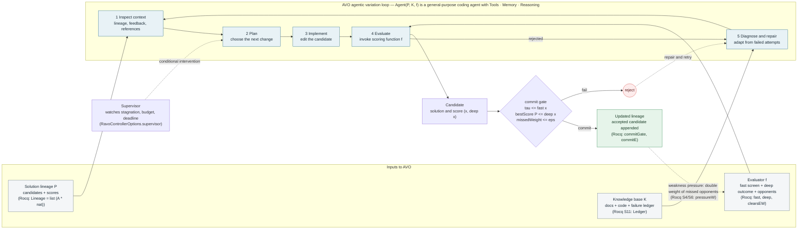
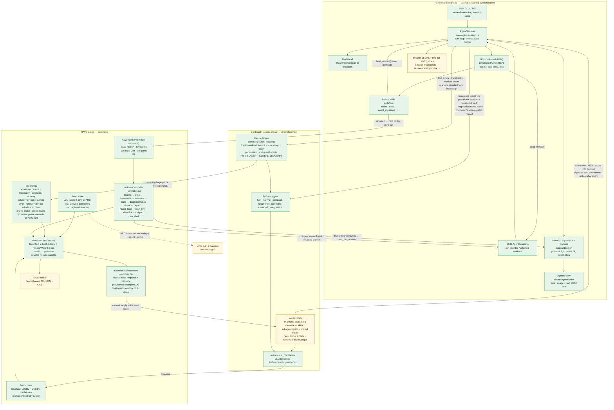
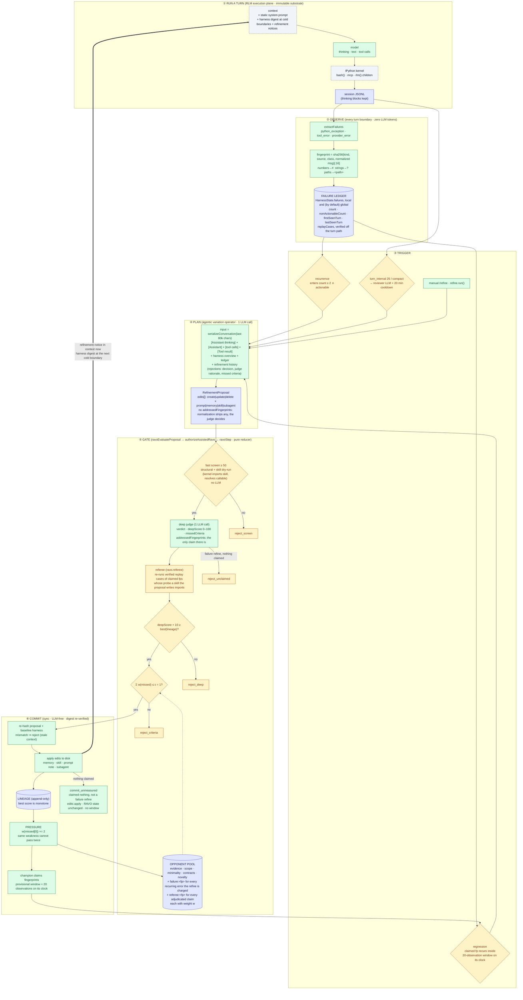
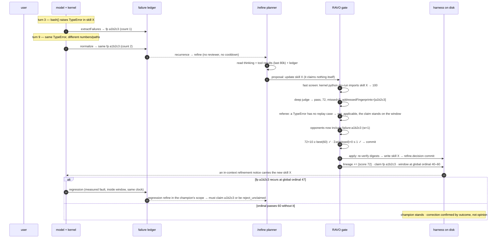

# RAVO and Prime Agent architecture (Mermaid)

Machine-readable maps for agents working on or inside the RAVO loop. Both diagrams are plain Mermaid so a model can read the edges directly; the Rocq references point at `Ravo.v` sections that prove the corresponding property.

## AVO agentic variation loop

## Prime Agent: three planes

## Reading the loop

- `P`, `K`, `f` are the three inputs of `Agent(P, K, f)`. In Prime, `P` is `HarnessState.ravo.lineage`, `K` is the harness plus the failure ledger, `f` is the fast/deep/opponent adapter set built by `RavoRunService`.
- The commit gate is the only place the lineage changes (`mutation_requires_authority`). A rejection never mutates state; it routes to Diagnose and repair.
- Weakness pressure runs on commit: every opponent the accepted candidate missed doubles in weight, so the same gap cannot be exploited twice (`pressureW_ge`).
- The token budget and deadline are stop conditions, not gates: they bound cost, they do not affect which candidates can be committed.

## The self-improvement loop, end to end

Stages: run a turn → observe failures at the turn boundary (`_observeFailuresAtTurnBoundary`) → trigger (actionable recurrence ≥ 2, regression inside the champion's 20-observation window, turn interval, compact, manual) → plan from the serialized chain of thought (`planRefinement`) → weighted gate with the referee, judging the live conversation and recording how far it moved while the proposal was planned (`ravoEvaluateProposal` → `authorizeAssistedRavo`) → apply, which decides the final outcome (`_applyRefine`) → the applied change reaches the running model as an in-context refinement notice, and later contexts through the harness digest delivered at cold boundaries (session start, resume, compaction); the system prompt itself stays static.

One concrete cycle:

## Claims, clocks, and the referee

- **The judge makes the claim.** A `/refine` proposal is normalized to its summary, rationale, expected outcome and edits, so an `addressedFingerprints` list the planner writes is dropped. The deep judge names the fingerprints the edits address, filtered to the recurring failures the gate charges, and only that list opens a provisional window and a trust claim. `ravo.run` differs: its implement child still writes `addressedFingerprints` into the artifact, and its opponents and commit gate read that. Its log line holds that claim to the judge: a `ravo.run` commit logs `refinement.committed` only for claims the judge also named (as `<fp>` or `failure:<fp>`) and the certificate did not charge. A self-claim alone is `refinement.applied_unmeasured`, though the champion still records it. A `ravo.run` is charged every actionable fingerprint recurring in the ledger of the store it runs against, with no recency window.
- **Where a `ravo.run` commits.** A local run reads, gates against and commits into the session store. A global run (`global_=True`, `/ravo --global`) uses the global store: its lineage, opponents, entries and failure ledger — the global ledger, which only has data while `PRIME_AGENT_GLOBAL_LEDGER` is on. Its commit reads, applies and saves under the same harness state lock every session's ledger flush takes, with the referee verdicts computed before the lock; checkpoints and the archive stay under the global dir. It does not see this session's observations that have not been flushed yet, which `/refine --global` folds in.
- **What a refine is charged.** A fingerprint recurs when its record is at or over the threshold (count ≥ 2) and actionable. A refine is always charged the recurring fingerprints whose recurrence or regression queued it, including those of a failure request merged into the agent's `refine.run`. Such a trigger is charged on its record in the recurrence ledger (the global one when it is on) when it recurs there, and otherwise on its record in the session's own ledger, so the repair of a failure counted while the global ledger was off can still claim it. A failure refine (`recurrence`, `regression`) is held to its triggers alone. Any other refine is also charged the fingerprints that recur in both the session's own ledger and the recurrence ledger and were last seen no more than 20 assistant turns before the branch's current turn and not after it (`0 ≤ currentTurn − lastSeenTurn ≤ 20`). The ledger does not track branches, so a failure last seen at a later turn than the branch has reached, as after a rewind, was seen on another branch and is not recent. A record is actionable unless a strict majority of its occurrences classified non-actionable (`nonActionableCount`: an outage, a denial, the network, a timeout); when the fingerprint's normalized message or exception class alone classifies that way, every occurrence counts, whatever tally was stored. A non-actionable occurrence never regresses a champion. A recurrence refine is queued when a fingerprint enters the recurring set (at or over the threshold and actionable by the majority of its occurrences), whether it crosses the threshold or turns actionable after crossing it. A `refine.run` merged into a queued failure refine is gated as `directed`.
- **Claimless results.** A failure refine the judge credits with no fingerprint is `reject_unclaimed`. Any other refine that commits without a claim is `commit_unmeasured`: the edits apply, but the RAVO state is left as it was (no lineage entry, no pressure, no window), and the log line is `refinement.applied_unmeasured`, never `refinement.committed`. A `ravo.run` commit with no credited claim logs the same line, but it does advance the RAVO state: it earned its certificate on that run's own evaluators.
- **Window clocks.** A provisional window is `[ordinal, ordinal + 20]`, counted in failure observations rather than turns, on the clock stamped with it. `"ordinal"` is the global ledger's observation total, used for local and global champions alike whenever `PRIME_AGENT_GLOBAL_LEDGER` is on. `"local-ordinal"` is the session ledger's total, used for a local window opened while the flag is off; a global window opened then gets no clock. At a turn boundary a window is compared only with an ordinal read off its own clock: `"local-ordinal"` windows always, `"ordinal"` windows only while the flag is on. A window with no clock (a legacy per-session turn count) or with a clock this build does not know (stripped on load) never regresses, so flipping the flag cannot reopen a closed window or match across clocks. `refineHarness`, which has no session, stamps `"ordinal"` for a global refine and `"local-ordinal"` for a local one. A session settles harness trust windows on the global ordinal whatever the flag says, at every failure ledger flush as well as at a `/refine` apply: local windows on the ordinal the flush merged, global windows under the harness state lock. With the flag off this session never advances that ordinal, so on its own it settles no window and moves no trust, and a recurrence inside a window is neither recorded nor adjudicated.
- **Trust after commit.** An upheld post-commit replay is the only thing that debits trust, and attribution is the whole difficulty: a fingerprint folds every missing module into one, a memory or prompt fix cannot be probed, and the skill may have been rewritten since. So a commit records, per skill it wrote, the modules and distributions that skill imports, and a replay is planned only for a `skill:<id>` whose imports are still exactly those; only on the newest overlapping window that recorded them (an older one, such as the window a regression repair replaced, is superseded); and only when the recurrence's own derived case probes one of those imports — an unrelated missing module recurring in the window runs nothing and uses no attempt. A case that has not reproduced yet waits for its self-check (`ravo.replay_verify`) and is planned once that lands. The replays run off the turn path under `harness.trust.adjudicate`, at most 8 per batch and one batch at a time.

  | situation | trust effect | re-run |
  |---|---|---|
  | `upheld` | −15 once per window on the skill entry the replay ran for; window `faulted` (terminal, also from `clean` or `contested`) | never |
  | `cleared` / `unverifiable` | none | on a later qualifying recurrence, up to 3 runs per (window, entry, fingerprint) |
  | recurrence of another module, or no applicable verified case | nothing runs | — |
  | window closes after a recurrence with no upheld verdict | `contested`: no credit, no debit | — |
  | window closes with no recurrence | `clean`: +5 to every entry it touched | — |

  A memory or prompt entry the same commit wrote is never debited; it can only miss the credit. A `+5` a clean close already granted stays even if a later upheld verdict faults that window. Below the dormancy threshold (30) an entry is dropped from the rendered prompt but stays fully readable and editable.
- **Regression repair.** A regressed champion is repaired in its own scope. Local and global regressions queue separate failure refines, a request never merges into a pending one of the other scope, and a parked request runs after the one ahead of it.
- **After a rejection.** When the certificate still binds, the proposal id is spent and cannot be evaluated again. The rejected result goes to the session JSONL and to the refinement history of the scope it targeted — `<agentDir>/harness/refinements.jsonl` for a global refine, `<agentDir>/harness/local-refinements/<sessionId>.jsonl` for a local one — and `refinement.rejected` is logged with the `cause` that classified it (`gate`, `screen`, `judge_unavailable`, `baseline_changed`, `stale_evidence`). The next planner reads a rejection's gate decision, the judge's rationale and the criteria it missed, never its scores; the judge's text is stripped of markup and invisible characters, truncated and quoted as untrusted output first. A serialized checkpoint or an approved auto-refine restarts the 20-minute cooldown whatever the gate decided, and a failure trigger fires once per fingerprint per session, so a rejected recurrence or regression refine is not retried in that session. A queued or requested refine (`refine.run`, `/refine`, a recurrence or regression repair) cancelled before it applies (by an abort, a branch change, or a compaction that aborts its plan), whether still queued or already planning, reports `refine_failed` and frees the fingerprints no other live request carries to trigger again. A periodic `turn_interval` or `compact` auto-refine that is cancelled is dropped without a report. The working model is not told: only an applied refinement adds a model-facing notice.
- **A rejection on evidence that moved.** The proposer and the judge read the conversation at different moments, and the session keeps working in between. The gate records the difference by message identity (`refine.evidence_drift`: `appended` when the judge read something new, `rewritten` when a compaction, a rewind or a dropped partial reply took away something the proposer read) and judges the live conversation either way — drift never cancels a refine. When the judge itself refused the proposal (`reject_deep`, `reject_criteria`, `reject_unclaimed`), the conversation had moved, and no referee verdict speaks against the claim, the rejection is a timing artefact: it is tagged `stale_evidence` and its round is left open. No cooldown is stamped, the turn interval is not reset, and the failures that queued it stay held; the refine plans once more on the current conversation as soon as the session is idle, at the same checkpoint in a serialized session. That re-plan carries `refine.replan_of`/`replanOf`, closes the round whatever it decides, and is never re-planned itself. A user `/refine`, a rollback and an already-re-planned refine are tagged but not re-planned. An armed re-plan an abort or a branch change drops releases its triggers, and reports `refine_failed` when the refine was the agent's own request; dispose drains it if it can and otherwise drops it silently.

The referee derives replay cases only from the kernel's own traceback for an `ipython` cell that raised, and only as two side-effect-free probes: `import X` (no module named X) and `importlib.metadata.version("d")` (no package metadata). A private module segment or a denylisted top-level module is never derived or run, a record keeps at most 8 distinct cases, all of them valid probes: a stored case of a retired kind (a module attribute, a `from X import n` name, an executable), or any source that no longer re-renders as a probe, is dropped when the ledger is next loaded or written, so it never holds a slot a live case would be evicted to free, and every place that runs or lists a case still refuses one: when X imports, a skill cannot make a guessed name exist. A case is evidence only after the self-check (`ravo.replay_verify`, in the sanitized environment: `PATH`, `HOME`, `LANG`, on Windows also what CPython needs to start, and explicit roots, no inherited `PYTHONPATH`) saw it reproduce its recorded exception. At the gate, each claimed fingerprint gets one verdict:

| status | when | effect |
|---|---|---|
| `not_applicable` | no case probes a module or distribution that a skill create/update in the proposal imports (a memory or prompt fix), or no case is derivable | nothing runs; the claim stands and the provisional window is its referee |
| `no_evidence` | applicable cases exist, none ever verified | `failure:<fp>` fails: the expected evidence is missing, so the claim fails closed |
| `upheld` | a verified applicable case raised its recorded exception again | `failure:<fp>` and `referee:<fp>` fail |
| `unverifiable` | a verified applicable case could not run, or raised something else | `failure:<fp>` and `referee:<fp>` fail |
| `cleared` | every verified applicable case ran clean | `failure:<fp>` and `referee:<fp>` pass |

Adjudication replays in `skillImportEnvironment`: the sanitized base plus the toolforge source roots and the host's `PYTHONPATH` entries, the same environment the skill dry-run screen imports in, and the same one a post-commit trust replay uses. Both run the interpreter in a fresh temporary working directory, so neither the environment nor the working directory can make the two disagree. Every replay interpreter leads its own process group, which is killed when the run ends, on host exit and on SIGINT, SIGTERM, SIGHUP or SIGQUIT, and is recorded in the orphan process journal while it runs, so supervisor recovery reaps it after a worker is killed outright. Only `upheld`, `unverifiable` and `cleared` add `referee:<fp>` to the pool. Persisted `arc:*` criteria are dormant passes in `/refine` and in a judge `ravo.run`, and keep their weights.
