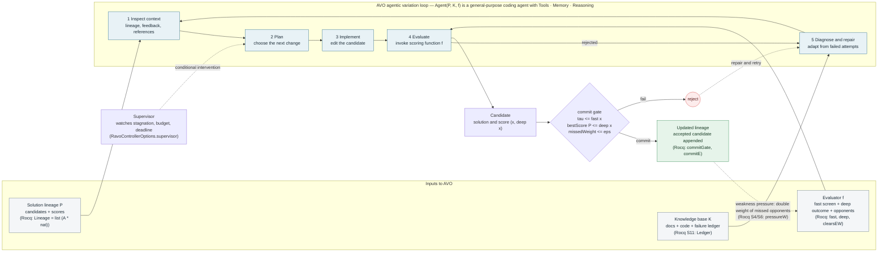
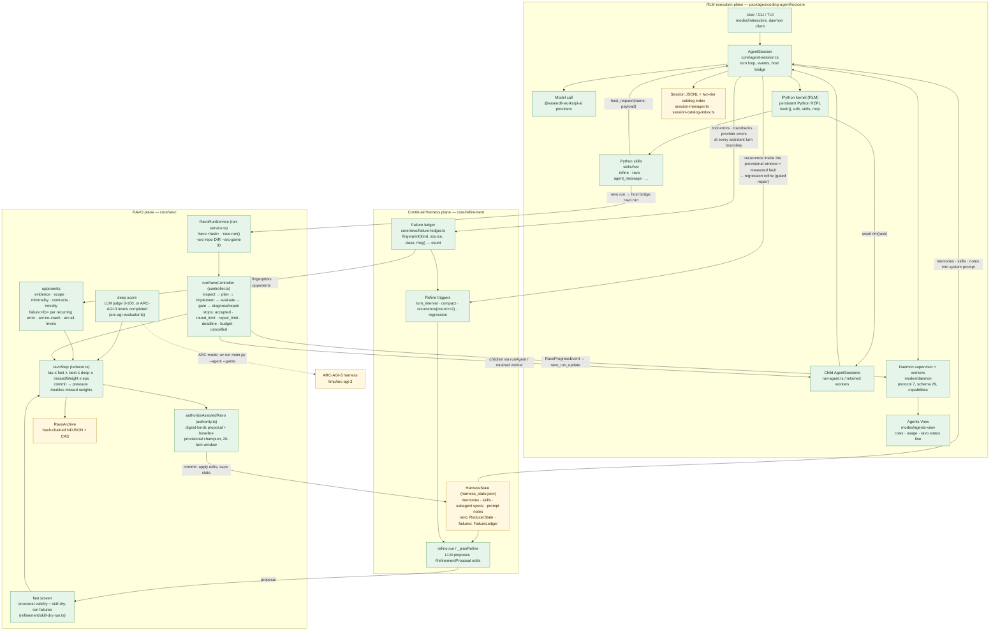
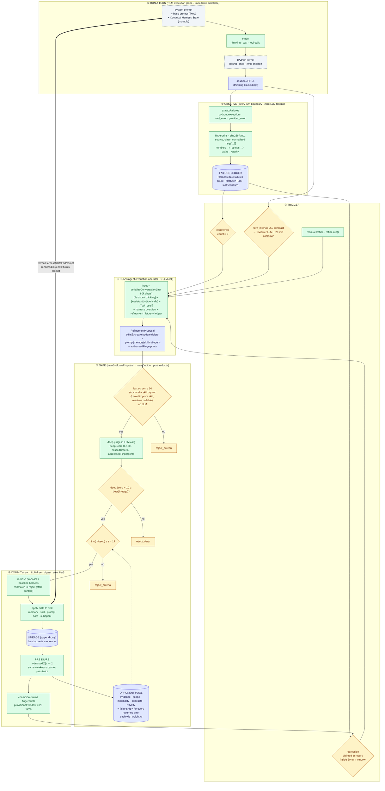
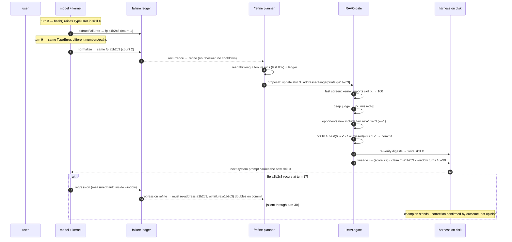

# RAVO and Prime Agent architecture (Mermaid)

Machine-readable maps for agents working on or inside the RAVO loop. Both diagrams are plain Mermaid so a model can read the edges directly; the Rocq references point at `Ravo.v` sections that prove the corresponding property.

## AVO agentic variation loop

## Prime Agent: three planes

## Reading the loop

- `P`, `K`, `f` are the three inputs of `Agent(P, K, f)`. In Prime, `P` is `HarnessState.ravo.lineage`, `K` is the harness plus the failure ledger, `f` is the fast/deep/opponent adapter set built by `RavoRunService`.
- The commit gate is the only place the lineage changes (`mutation_requires_authority`). A rejection never mutates state; it routes to Diagnose and repair.
- Weakness pressure runs on commit: every opponent the accepted candidate missed doubles in weight, so the same gap cannot be exploited twice (`pressureW_ge`).
- The token budget and deadline are stop conditions, not gates: they bound cost, they do not affect which candidates can be committed.

## The self-improvement loop, end to end

Stages: run a turn → observe failures at the turn boundary (`_observeFailuresAtTurnBoundary`) → trigger (recurrence ≥ 2, regression inside the 20-turn window, turn interval, manual) → plan from the serialized chain of thought (`planRefinement`) → weighted gate (`ravoDecide`) → commit with pressure (`ravoCommit`) → harness rendered into the next system prompt.

One concrete cycle:

